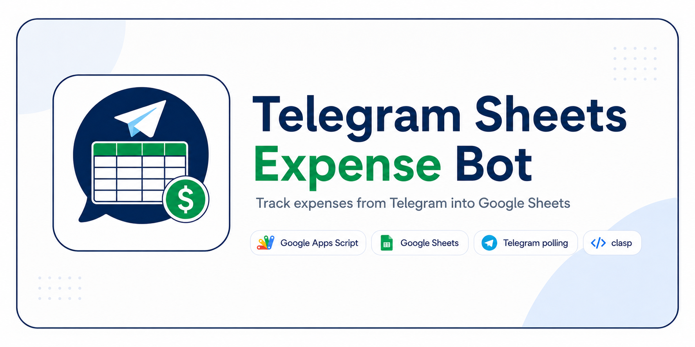
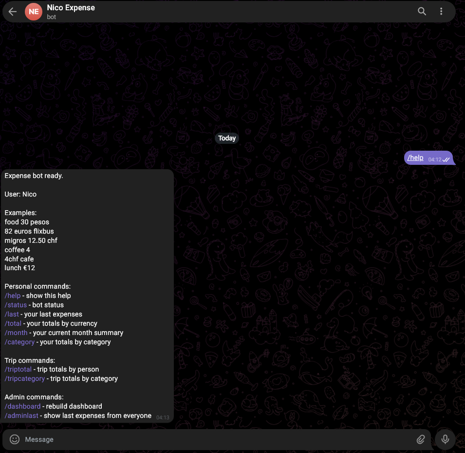
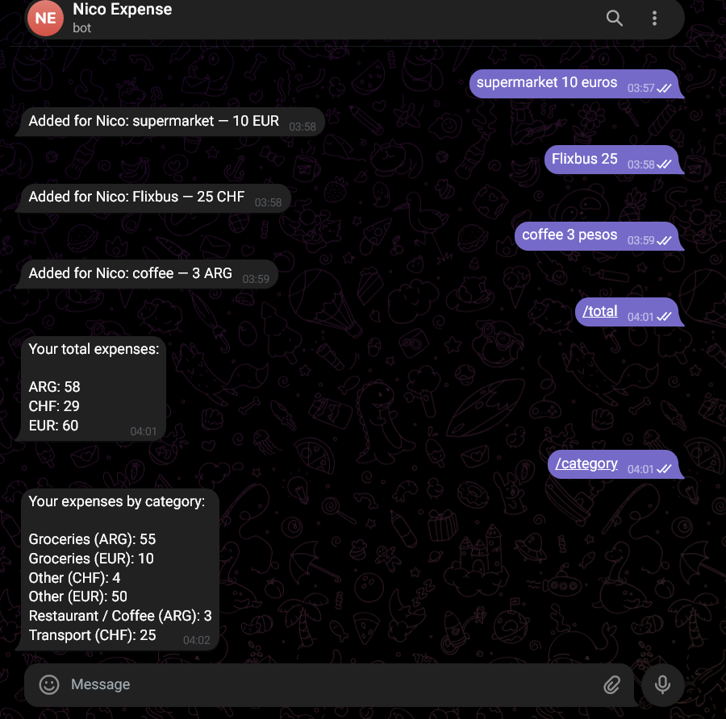
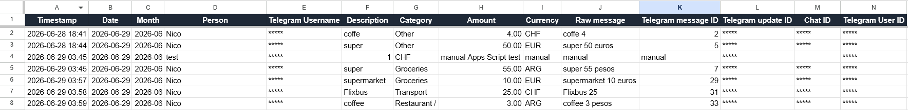
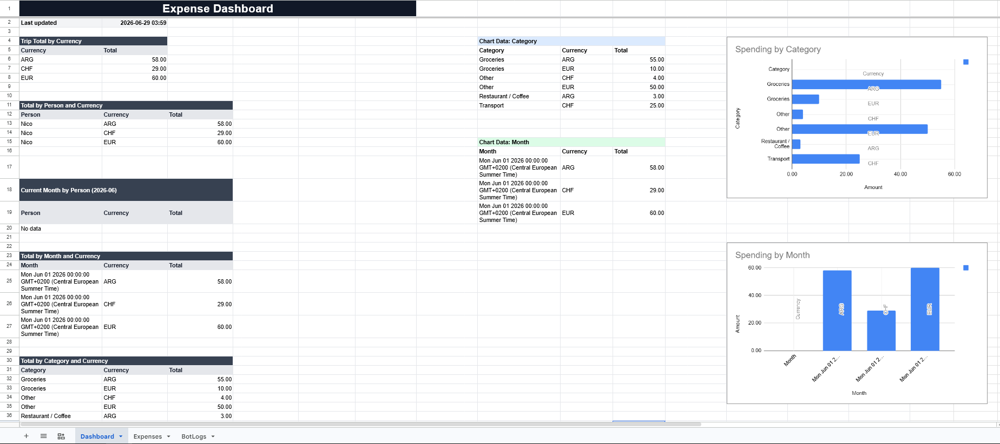

# Telegram Sheets Expense Bot

<p align="center">
  
</p>

<p align="center">
  <a href="LICENSE">
    
  </a>
  
  
  
  
  
  
  
</p>

<p align="center">
  <strong>A Telegram expense tracker bot powered by Google Apps Script and Google Sheets.</strong>
</p>

<p align="center">
  Send messages like <code>coffee 4</code>, <code>flixbus 82 euro</code>, or <code>migros 12.50 chf</code> and automatically track expenses, users, categories, currencies, dashboards, and shared trip totals.
</p>


---

## Overview

**Telegram Sheets Expense Bot** is a reusable public template for building a private expense tracker with Telegram, Google Apps Script, and Google Sheets.

Each user installs their own copy with:

* their own Telegram bot,
* their own Google Sheet,
* their own Apps Script project,
* their own private Script Properties.

The public repository does **not** contain Telegram tokens, spreadsheet IDs, Telegram user IDs, OAuth files, or personal expense data.

---

## Features

* Track expenses directly from Telegram.
* Parse natural messages such as `coffee 4`, `migros 12.50 chf`, `lunch €12`, and `82 euros FlixBus`.
* Save expenses to Google Sheets.
* Automatically create and maintain:

  * `Expenses`
  * `BotLogs`
  * `Dashboard`
* Support multiple currencies.
* Auto-detect categories with configurable rules.
* Support personal mode and multi-user/family trip mode.
* Separate normal users from admins.
* Use Telegram polling with `getUpdates`.
* Avoid webhook deployment complexity.
* Develop locally with `clasp`.
* Keep secrets private with Apps Script `PropertiesService`.
* Provide setup, security, troubleshooting, architecture, and command documentation.

---

## Screenshots

### Telegram help



The bot explains supported message formats and available commands.

### Expense tracking conversation



The bot parses expense messages, stores them, and replies with confirmations and summaries.

### Expenses sheet



Expenses are stored as normalized rows with user, description, category, amount, currency, date, and Telegram metadata.

### Dashboard



The dashboard summarizes spending by user, currency, category, and month.

More screenshot notes are available in [docs/screenshots.md](docs/screenshots.md).

---

## Demo messages

```text
coffee 4
82 euros FlixBus
migros 12.50 chf
cafe 4chf
lunch €12
supermarket 10 euros
coffee 3 pesos
```

The bot extracts:

* description,
* amount,
* currency,
* category,
* Telegram user,
* date,
* month,
* message ID,
* update ID.

---

## Project status

This template has been tested with a clean Apps Script project using `clasp`.

Verified:

* Telegram polling with `getUpdates`
* Script Properties configuration
* Telegram connection test
* Google Sheets expense storage
* Multiple currencies
* Category detection
* Dashboard setup
* Bot logs
* Admin/user permissions
* `.clasp.json`, `.clasprc.json`, tokens, and spreadsheet IDs are not committed

---

## How it works

```text
Telegram user
  ↓
Telegram Bot API getUpdates
  ↓
Google Apps Script polling trigger
  ↓
Parser
  ↓
User permission check
  ↓
Google Sheets Expenses tab
  ↓
Dashboard + charts
  ↓
Telegram command replies
```

More details: [ARCHITECTURE.md](ARCHITECTURE.md)

---

## Tech stack

| Layer             | Technology                       |
| ----------------- | -------------------------------- |
| Bot interface     | Telegram Bot API                 |
| Backend/runtime   | Google Apps Script               |
| Language          | JavaScript, V8 runtime           |
| Storage           | Google Sheets                    |
| Dashboard         | Google Sheets tables and charts  |
| Scheduling        | Apps Script time-driven triggers |
| Local development | clasp                            |
| Configuration     | Apps Script Script Properties    |

---

## Why polling instead of webhooks?

This project uses Telegram polling with `getUpdates` because it is simpler and more reliable for beginner-friendly Apps Script deployments.

Webhook deployments can work, but they require extra deployment steps and can cause confusion with retries, duplicate rows, old pending updates, and Apps Script web app configuration.

For expense tracking, a 1-minute polling trigger is usually enough.

Read more: [docs/polling-vs-webhook.md](docs/polling-vs-webhook.md)

---

## Quick start

```bash
git clone https://github.com/Nico-Ry/telegram-sheets-expense-bot.git
cd telegram-sheets-expense-bot
npm install
npm run clasp:login
```

Then:

1. Create a Telegram bot with BotFather.
2. Create a Google Sheet.
3. Create or connect a Google Apps Script project with `clasp`.
4. Push the source code.
5. Store private values in Apps Script Script Properties.
6. Run `validateConfig`.
7. Run `testTelegramConnection`.
8. Run `setupOnce`.
9. Send a Telegram test message.
10. Check the Google Sheet.

Full setup guide: [SETUP.md](SETUP.md)

---

## Required private configuration

The public repository does not contain secrets. Configure these values in Apps Script Script Properties:

| Key                   | Example                                        | Required |
| --------------------- | ---------------------------------------------- | -------- |
| `BOT_TOKEN`           | `123456:ABC...`                                | Yes      |
| `SPREADSHEET_ID`      | `1abcDEF...`                                   | Yes      |
| `BOT_USERS_JSON`      | `{"123456789":{"name":"Nico","role":"admin"}}` | Yes      |
| `ALLOW_UNKNOWN_USERS` | `false`                                        | No       |
| `ENABLE_LOGGING`      | `true`                                         | No       |

Never commit real tokens, spreadsheet IDs, Telegram user IDs, `.clasp.json`, `.clasprc.json`, OAuth files, or credentials.

---

## Commands

| Command         | Access | Description                                 |
| --------------- | ------ | ------------------------------------------- |
| `/help`         | User   | Show available commands and examples.       |
| `/status`       | User   | Show bot status and current user info.      |
| `/last`         | User   | Show recent personal expenses.              |
| `/total`        | User   | Show personal totals by currency.           |
| `/month`        | User   | Show current month personal totals.         |
| `/category`     | User   | Show personal totals by category.           |
| `/triptotal`    | User   | Show shared trip/family totals by person.   |
| `/tripcategory` | User   | Show shared trip/family totals by category. |
| `/dashboard`    | Admin  | Rebuild the Google Sheets dashboard.        |
| `/adminlast`    | Admin  | Show latest expenses across all users.      |

Full command guide: [docs/command-reference.md](docs/command-reference.md)

---

## Sheet structure

The bot creates and manages three main sheets.

| Sheet       | Purpose                                                                       |
| ----------- | ----------------------------------------------------------------------------- |
| `Expenses`  | Main expense table with normalized expense rows.                              |
| `BotLogs`   | Runtime logs, parser issues, permission errors, API errors, and setup events. |
| `Dashboard` | Tables, summaries, charts, and shared trip overview.                          |

The `Expenses` sheet stores fields such as timestamp, date, month, person, Telegram username, description, category, amount, currency, raw message, Telegram message ID, update ID, chat ID, and Telegram user ID.

---

## Multi-user and trip mode

Each Telegram user is configured in `BOT_USERS_JSON` with a display name and role.

Example:

```json
{
  "123456789": {
    "name": "Nico",
    "role": "admin"
  },
  "987654321": {
    "name": "Alex",
    "role": "user"
  }
}
```

Normal users can:

* add their own expenses,
* see their own totals,
* see their own category summaries.

Admins can:

* rebuild the dashboard,
* see latest expenses across all users,
* manage shared trip/family summaries.

More details: [docs/multi-user-trip-mode.md](docs/multi-user-trip-mode.md)

---

## Security model

This project separates public source code from private configuration.

Private values are stored in Apps Script Script Properties, not in GitHub.

Do not commit:

* Telegram bot tokens,
* Google Spreadsheet IDs,
* Telegram user IDs,
* real expense data,
* `.clasp.json`,
* `.clasprc.json`,
* OAuth credentials,
* screenshots with private data.

Google Sheet access and Telegram bot access are separate. A Telegram user can interact with the bot only if the bot allows them, but that does not automatically give them access to the Google Sheet. The Google Sheet remains private unless the owner shares it through Google Drive.

Security guide: [SECURITY.md](SECURITY.md)

---

## Documentation

| Document                                                     | Description                              |
| ------------------------------------------------------------ | ---------------------------------------- |
| [SETUP.md](SETUP.md)                                         | Complete installation guide.             |
| [SECURITY.md](SECURITY.md)                                   | Security and privacy recommendations.    |
| [TROUBLESHOOTING.md](TROUBLESHOOTING.md)                     | Common problems and fixes.               |
| [ARCHITECTURE.md](ARCHITECTURE.md)                           | System design and file responsibilities. |
| [docs/command-reference.md](docs/command-reference.md)       | Bot command reference.                   |
| [docs/polling-vs-webhook.md](docs/polling-vs-webhook.md)     | Why the template uses polling.           |
| [docs/multi-user-trip-mode.md](docs/multi-user-trip-mode.md) | Multi-user and shared trip mode.         |
| [docs/screenshots.md](docs/screenshots.md)                   | Screenshot guidance.                     |

---

## Troubleshooting

Common issues are documented in [TROUBLESHOOTING.md](TROUBLESHOOTING.md), including:

* Bot does not answer.
* Wrong Telegram token.
* Wrong spreadsheet ID.
* Duplicate messages.
* Webhook vs polling confusion.
* `getUpdates` offset problems.
* Google authorization warning.
* Triggers not running.
* Dashboard not updating.
* `clearCharts is not a function`.
* Bot logs getting too large.
* Family member blocked by private mode.

---

## Roadmap

Planned or possible improvements:

* `/adduser`, `/removeuser`, and `/users` admin commands.
* Optional category rules from a Google Sheet tab.
* Monthly budget alerts.
* CSV export command.
* Web app setup screen.
* More parser tests.
* Optional deployment checklist.
* Optional GitHub Actions documentation checks.
* Better dashboard visuals.

---

## Built with

This project uses:

* [Google Apps Script](https://developers.google.com/apps-script)
* [Google Apps Script V8 runtime](https://developers.google.com/apps-script/guides/v8-runtime)
* [Apps Script PropertiesService](https://developers.google.com/apps-script/reference/properties/properties-service)
* [Google Sheets](https://www.google.com/sheets/about/)
* [Telegram Bot API](https://core.telegram.org/bots/api)
* [Telegram Bot API getUpdates](https://core.telegram.org/bots/api#getupdates)
* [clasp - Command Line Apps Script Projects](https://github.com/google/clasp)
* [Shields.io](https://shields.io/) for README badges

---

## Not affiliated

This project is an independent open-source template.

It is not affiliated with, endorsed by, or sponsored by Telegram, Google, or Google Apps Script.

---

## Author

Created by [Nico-Ry](https://github.com/Nico-Ry).

---

## License

This project is released under the [MIT License](LICENSE).

You are free to use, copy, modify, merge, publish, distribute, sublicense, and sell copies of the software, as long as the license notice is included.

The software is provided without warranty. See the [LICENSE](LICENSE) file for the full license text.
